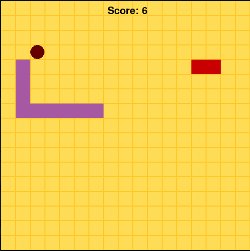

# Snake

## Introduction
Our game is the game Snake but then with a twist. You control a purple snake that moves around the board, growing longer as it eats fruit represented as round balls. The goal is to survive as long as possible while avoiding bumping into yourself, the walls or the enemy. This enemy moves randomly across the board and if you collide with it, the game ends. 

## Install/Run Instructions
First make sure you have Python installed on your computer. Then open a terminal in the game folder and install the package using pip install -r requirements.txt. After that, you can run the game by typing python play.py. The game window should open and you can play the game.

## Play Instructions
When you start the game clicking Space, use the arrow keys to move the snake around the board. The snake will always keep moving so you can only change the direction. Eat the food that appears as round balls on the board, so the snake grows Do not hit the walls, run into your own body or touch the enemy snake. Also watch out for the direction of the enemy so the enemy snake does not collide with your snake, since this also means game over. When you are game over, you can click R to play it again and H to go to homescreen. Lastly, it is possible to turn off the enemy by clicking E on your keyboard, however if you already played the game, you should return to the homescreen by clicking H to be able to change this feature. 

## Authors
Linda Tang, Nicole Coenen & Vincent Bosch
